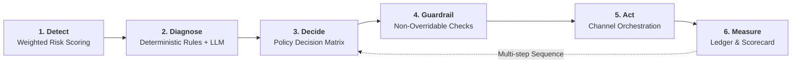

# ⚡ Razorpay AI Revenue Recovery Agent

<div align="center">

[](https://www.python.org/)
[](https://fastapi.tiangolo.com/)
[](https://streamlit.io/)
[](https://docs.pydantic.dev/)
[](https://sqlite.org/)
[](#guardrails-matrix)
[](#llm-resiliency--fail-safes)

**An autonomous, rule-driven, guardrailed revenue recovery system designed for enterprise payments.**  
*Recovers lost revenue across payment declines, cart drop-offs, subscription dunning, and overdue B2B receivables with mathematical safety and zero hallucination risk.*

[Quickstart](#-quickstart) • [Architecture](#-architecture) • [The 6-Stage Loop](#-the-6-stage-autonomous-loop) • [Guardrails](#-enterprise-guardrail-matrix) • [API Reference](#-api-reference) • [Live Dashboard](#-interactive-dashboard)

</div>

---

## 📌 Executive Summary

Revenue leakage costs high-volume digital merchants **3% to 7% of Gross Merchandise Value (GMV)** each year. Most recovery workflows are brittle: either dumb cron jobs blasting spammy SMS reminders, or reckless LLM bots hallucinating unauthorised discounts and violating regulatory compliance.

The **Razorpay AI Revenue Recovery Agent** bridges this gap using a **hybrid deterministic-generative architecture**:
- **Deterministic Python Core**: Detects, scores risk, diagnoses root cause, selects interventions, and enforces regulatory guardrails through mathematical rules and decision matrices. **Zero hallucinated policies.**
- **Bounded LLM Composition**: Large Language Models (Google Gemini Flash / Anthropic Claude) are used *strictly* for natural language synthesis (Hinglish/English dynamic messaging) and parsing unstructured abandonment notes.
- **Fail-Safe Offline Autonomy**: If the LLM experiences rate limits or network degradation, the agent instantly drops back to verified fallback templates. The recovery loop **never halts**.
- **Immutable SQLite Audit Trail**: Every single event transition, prompt, response, discount cap, and guardrail evaluation is cryptographically traceable for financial compliance.

```
┌─────────────────────────────────────────────────────────────────────────────────┐
│                           BATCH RUN PERFORMANCE SNAPSHOT                        │
│   Processed: 240 Events  │  At Risk: ₹3.19 Cr  │  Recovered: ₹1.01 Cr (31.64%)  │
│   Guardrail Interventions: 77 Blocks  │  Human Escalations: 74  │  Time: ~4.1s  │
└─────────────────────────────────────────────────────────────────────────────────┘
```

---

## 🎯 The 4 Revenue Leakage Vectors

The agent natively addresses the four most critical recovery channels:

| Category | Typical Causes | Agent Remediation Workflow |
|---|---|---|
| **💳 Payment Failure** | Bank downtime, insufficient funds, network drops, card expiry | Real-time smart retry, delayed retry during peak uptime windows, automated 1-click update link |
| **🛒 Checkout Abandonment** | High shipping fees, promo code failure, hesitation | Intent-based nudge, bounded dynamic discount (governed by global margin budget) |
| **🔁 Subscription Renewal** | Involuntary churn, mandate renewal fails, card expiration | Multi-step dunning cadence, smart retry sequence, urgent fallback notifications |
| **📑 Overdue B2B Receivables** | Invoice forgotten, cashflow delays, disputed terms | Polite reminder, formal promise-to-pay (PTP) scheduling, auto-escalation to human collections |

---

## 🔄 The 6-Stage Autonomous Loop

The entire recovery engine revolves around a closed-loop execution pattern:



1. **Detect (`core/detector.py`)**: Computes `risk_score` (0.0 - 1.0), `recoverable_amount`, and `priority_score` based on payment reliability, recency, segment weight, and transaction volume.
2. **Diagnose (`core/diagnoser.py`)**: Maps bank decline codes, error strings, and abandonment text into normalized root causes (e.g., `insufficient_funds`, `gateway_timeout`, `high_shipping_fee`).
3. **Decide (`core/policy.py`)**: Uses an auditable lookup matrix `(category, root_cause, segment, attempt_count) -> intervention`. No stochastic randomness in decision-making.
4. **Guardrail (`core/guardrails.py`)**: Enforces hard boundaries (cooldowns, DND, budget limits) that can only downgrade or block actions—never escalate risk.
5. **Act (`core/executor.py` & `core/composer.py`)**: Composes personalized English/Hinglish copy via LLM (or template fallback) and dispatches action across Email, SMS, WhatsApp, or Gateway retry.
6. **Measure (`core/audit.py` & `core/orchestrator.py`)**: Records full step results, updates recovery totals, and feeds multi-attempt dunning schedules.

---

## 🛡️ Enterprise Guardrail Matrix

The guardrail engine (`core/guardrails.py`) evaluates **every single event** prior to execution. Guardrails are unilateral: they can downgrade an intervention to a lower-friction channel or force `no_action`, but can never increase risk.

```
┌──────────────────────────────┬───────────────────────────────┬─────────────────────────────────┬──────────────┐
│ Guardrail Rule               │ Trigger Condition             │ System Action                   │ Overridable? │
├──────────────────────────────┼───────────────────────────────┼─────────────────────────────────┼──────────────┤
│ 1. Compliance Short-Circuit  │ Disputed charge, fraud hold,  │ Immediate abort (no_action)     │ ❌ NEVER     │
│                              │ legal flag on account         │ Routes directly to human rep    │              │
│ 2. DND / Opt-Out             │ Customer on TRAI DND registry │ Immediate abort (no_action)     │ ❌ NEVER     │
│                              │ or previously opted out       │ Total messaging blackout        │              │
│ 3. Velocity / Max Attempts   │ attempt_count >= threshold    │ Force escalation to human agent │ ❌ NEVER     │
│                              │ (Segment-tuned: 2 to 4 max)   │ Halts automated channel retry   │              │
│ 4. Cooldown Window           │ Last contact < N hours ago    │ Suppresses outreach until next  │ ❌ NEVER     │
│                              │ (e.g. 12h-24h window)         │ batch cycle                     │              │
│ 5. Quiet Hours Enforcement   │ Outreach outside 09:00-20:00  │ Defers communication until      │ ❌ NEVER     │
│                              │ for restricted jurisdictions  │ local business hours open       │              │
│ 6. Dynamic Margin Budget     │ Discount > 15% OR             │ Caps discount to min(ceiling,%) │ ❌ NEVER     │
│                              │ Batch discount pool depleted  │ Drops back to 0% if pool empty  │              │
└──────────────────────────────┴───────────────────────────────┴─────────────────────────────────┴──────────────┘
```

---

## 🏗️ Architecture & Technology Stack

```
                          ┌─────────────────────────────────────┐
                          │         REST API / CLI CLIENT       │
                          │   FastAPI (api/)  •  CLI (batch/)   │
                          └──────────────────┬──────────────────┘
                                             │
                                  ┌──────────▼──────────┐
                                  │   orchestrator.py   │
                                  └──────────┬──────────┘
                                             │
      ┌──────────────────┬───────────────────┼───────────────────┬──────────────────┐
      ▼                  ▼                   ▼                   ▼                  ▼
┌───────────┐      ┌───────────┐       ┌───────────┐       ┌───────────┐      ┌───────────┐
│ detector  │      │ diagnoser │       │  policy   │       │ guardrails│      │ composer  │
│ (Weights) │      │ (Rules)   │       │  (Matrix) │       │ (Bounds)  │      │  (+ LLM)  │
└─────┬─────┘      └─────┬─────┘       └─────┬─────┘       └─────┬─────┘      └─────┬─────┘
      │                  │                   │                   │                  │
      └──────────────────┴───────────────────┼───────────────────┴──────────────────┘
                                             │
                                  ┌──────────▼──────────┐
                                  │   SQLite Audit DB   │
                                  │    (Immutable)      │
                                  └──────────┬──────────┘
                                             │
                                  ┌──────────▼──────────┐
                                  │ Streamlit Dashboard │
                                  │ (KPIs / Risk Queue) │
                                  └─────────────────────┘
```

### Technology Highlights
- **Engine**: Python 3.10+, Pydantic v2 (Strict Schema Validation)
- **API Surface**: FastAPI with Uvicorn (Asynchronous, OpenAPI 3.0 auto-documented)
- **Analytics & BI**: Streamlit with custom glassmorphic CSS design system and Plotly Charts
- **LLM Integration**: Google GenAI SDK (`gemini-2.5-flash` / `gemini-1.5-flash`), Anthropic SDK (`claude-3-5-sonnet`)
- **Persistence**: ACID-compliant SQLite audit trail (`data/audit.db`)

---

## 🚀 Quickstart

### 1. Prerequisites & Environment Setup

```bash
# Clone the repository
git clone https://github.com/Ranveer46/RazorPay-challenge.git
cd "RazorPay challenge"

# Create and activate virtual environment
python -m venv .venv
# On Windows:
.venv\Scripts\activate
# On Linux/macOS:
source .venv/bin/activate

# Install dependencies
pip install -r requirements.txt
```

### 2. Configure Environment (Optional LLM & Gateway Keys)

```bash
cp .env.example .env
```
Edit `.env` to supply API keys:
```ini
# Optional LLM Keys (Falls back to deterministic offline templates if unset):
GEMINI_API_KEY=your_gemini_api_key_here
# or
ANTHROPIC_API_KEY=your_anthropic_api_key_here

# Optional Razorpay Gateway Keys (Enables live sandbox Payment Links, Invoices, & Webhooks):
# If left blank, the agent runs in 100% offline simulated mode.
RAZORPAY_KEY_ID=rzp_test_your_key_id
RAZORPAY_KEY_SECRET=your_key_secret
RAZORPAY_WEBHOOK_SECRET=your_webhook_secret
```

### 3. Run the End-to-End Batch Pipeline

Process 240 synthetic revenue events with full scoring, guardrail enforcement, and audit output in **under 5 seconds**:

```bash
python -m batch.run_batch
```

### 4. Launch the Interactive Dashboard

```bash
# If your virtual environment is activated:
streamlit run dashboard/app.py

# Or run directly via your venv (Windows PowerShell):
.venv\Scripts\python -m streamlit run dashboard/app.py
```
Open **`http://localhost:8501`** in your browser to interact with the real-time Risk Queue, KPI scorecards, and step-by-step audit drill-downs.

### 5. Launch the REST API

```bash
# If your virtual environment is activated:
uvicorn api.server:app --reload --port 8000

# Or run directly via your venv (Windows PowerShell):
.venv\Scripts\python -m uvicorn api.server:app --reload --port 8000
```
Interactive Swagger documentation is available at **`http://127.0.0.1:8000/docs`**.

---

## 📊 Sample Benchmark Scorecard

Output from a reproducible benchmark run (`python -m batch.run_batch`, seed 7, 240 events):

```
========================================================================
BATCH SCORECARD  (BATCH-4ff0ce5d)
========================================================================
Total events processed:     240
Total revenue at risk:      ₹3,19,90,889.09  (~₹3.20 Cr)
Total revenue recovered:    ₹1,01,23,480.37  (~₹1.01 Cr)
Overall recovery rate:      31.64%

Recovery rate by category:
  Category                  Events         At Risk       Recovered   Rate %   Recov. Ev
  ─────────────────────────────────────────────────────────────────────────────────────
  Payment Failure               60   ₹14,44,518.30    ₹5,12,066.89    35.4%     20 / 60
  Checkout Abandonment          60    ₹6,88,200.13    ₹2,06,001.46    29.9%     20 / 60
  Subscription Renewal          60    ₹3,20,056.80    ₹1,19,346.66    37.3%     21 / 60
  Receivable Overdue            60  ₹2,95,38,113.86   ₹92,86,065.36    31.4%     20 / 60

Guardrail-blocked events:   77
  • Cooldown window active:        50
  • TRAI DND / Customer Opt-Out:   24
  • Compliance short-circuit:      13
  • Quiet hours suppression:        3
  • Max retry ceiling hit:          1

Escalations to Human Reps:  74
Avg Steps to Recovery:      1.26 steps
Total Runtime:              4.12 seconds
========================================================================
```

---

## 🔌 API Reference

The FastAPI service exposes 7 high-throughput endpoints for integration into core payment rails:

| Method | Endpoint | Description |
|---|---|---|
| `GET` | `/` | Service health status, system metadata, live gateway status, and event count |
| `GET` | `/risk/queue?limit=50` | Prioritized queue of revenue-at-risk events sorted by urgency |
| `POST` | `/events/ingest` | Real-time event ingestion for payment decline/abandonment events |
| `POST` | `/recover/{event_id}/execute` | Triggers the 6-stage autonomous recovery loop for a specific event |
| `GET` | `/audit/{event_id}` | Complete immutable step-by-step audit trail for compliance |
| `POST` | `/batch/run` | Triggers a full asynchronous batch recovery simulation |
| `GET` | `/metrics/batch/{batch_id}` | Retrieves aggregate recovery metrics and guardrail statistics |
| `POST` | `/webhook/razorpay` | Ingests live Razorpay Webhooks (`payment.failed`, `invoice.payment_failed`) with HMAC verification |

### Razorpay Gateway Integration (Sandbox / Test Mode)

The agent supports official Razorpay Python SDK integration via a **dual-mode adapter**:
- **Live Sandbox Mode**: When `RAZORPAY_KEY_ID` & `RAZORPAY_KEY_SECRET` are configured in `.env`, the agent creates real Razorpay Payment Links (`https://rzp.io/i/...`) and Invoices, embedding them directly into customer outreach copy.
- **Offline Fallback Mode**: If keys are absent, the agent seamlessly operates in 100% offline simulated mode with realistic demo links (`https://rzp.io/l/...`).

### Example Request: Recover Single Event

```bash
curl -X POST http://127.0.0.1:8000/recover/EVT-0020-70885f/execute
```

**Response:**
```json
{
  "event_id": "EVT-0020-70885f",
  "category": "receivable_overdue",
  "amount_at_risk": 795506.39,
  "amount_recovered": 795506.39,
  "recovered": true,
  "steps_taken": 1,
  "intervention_path": ["send_promise_to_pay_request"],
  "escalated": false,
  "blocked_by_guardrail": false,
  "final_status": "recovered"
}
```

---

## 🖥️ Interactive Dashboard

The Streamlit UI provides deep operational visibility into the recovery engine:

1. **📊 Overview Tab**:
   - Real-time KPI Cards (Revenue at Risk, Recovered Amount, Conversion Rate, Escalations)
   - Category performance breakdown bar charts
   - Outcome distribution mix (Recovered vs Blocked vs Escalated vs Unresolved)
   - Guardrail and Escalation breakdown analytics
2. **🎯 Risk Queue Tab**:
   - Filterable, searchable table with instant risk-scoring priority indicators
   - Multi-select filters for Segment (Enterprise, SMB, Consumer) and Category
   - Indian Rupee currency formatting (`₹xx,xx,xxx`)
3. **🧾 Audit Drill-Down Tab**:
   - Inspect individual event execution paths step-by-step
   - Compare pre-guardrail vs post-guardrail interventions
   - View exact LLM prompts, model responses, and template fallbacks
   - Full JSON input/output inspection for regulatory audits

---

## 🧪 Testing & Validation

The codebase includes an extensive automated test suite covering deterministic policies, guardrail stop rules, and orchestrator loops:

```bash
# Run the complete test suite
pytest tests/ -v
```

### Coverage Scope
- `tests/test_policy.py`: Verifies deterministic mapping for all combinations of category, root cause, and attempt sequence.
- `tests/test_guardrails.py`: Confirms non-overridability of DND, compliance flags, quiet hours, cooldown periods, and budget constraints.
- `tests/test_orchestrator.py`: Tests the full 6-stage lifecycle, multi-step loops, and fallback mechanisms.

---

## 🛡️ LLM Resiliency & Fail-Safes

Production financial infrastructure requires **99.999% uptime**. The agent was intentionally architected so that **no LLM outage can take down the payment recovery pipeline**:

1. **Strict Decoupling**: The decision engine does **not** rely on LLMs to determine actions. Deciding *what* to do is 100% deterministic.
2. **Graceful Fallback**: If Gemini or Anthropic endpoints return HTTP 429 (rate limits), 500 (internal errors), or timeout, the `llm_client` raises `LLMUnavailable`.
3. **Template Engine**: `core/composer.py` immediately swaps to battle-tested, parameterized message templates in both English and Hinglish.
4. **Token Budget Floor**: Built-in mitigations handle "thinking token" expansion in modern flash models to prevent unexpected truncation.

---

## 👥 Repository Structure

```
.
├── api/
│   └── server.py              # FastAPI production REST gateway
├── batch/
│   └── run_batch.py           # High-throughput batch evaluation & CLI scorecard
├── core/
│   ├── audit.py               # SQLite append-only compliance audit trail
│   ├── composer.py            # LLM copy generation (English/Hinglish) with template fallbacks
│   ├── detector.py            # Explainable weighted risk and priority scoring
│   ├── diagnoser.py           # Root cause diagnosis (deterministic rules + LLM text parser)
│   ├── executor.py            # Workflow dispatcher and outcome simulation model
│   ├── guardrails.py          # Non-overridable compliance, quiet hours, & budget rules
│   ├── llm_client.py          # Resilient multi-provider client (Gemini, Claude, offline)
│   ├── models.py              # Pydantic schemas shared across the pipeline
│   ├── orchestrator.py        # 6-stage lifecycle driver (single event & batch)
│   ├── policy.py              # Deterministic decision table
│   └── razorpay_gateway.py    # Official Razorpay SDK adapter (Payment Links, Invoices, Webhooks)
├── dashboard/
│   ├── app.py                 # Interactive Streamlit operations console
│   └── styles.py              # FinTech design system & injected CSS
├── data/
│   ├── generate_dataset.py    # Synthetic dataset generator with realistic ground truth
│   ├── events.json            # Generated benchmark dataset
│   └── scorecard.json         # Latest batch execution scorecard
└── tests/                     # Comprehensive test suite (47 automated tests)
```

---

<div align="center">
Built with precision for the <b>Razorpay Challenge</b>. Engineered for scale, compliance, and deterministic reliability.
</div>
